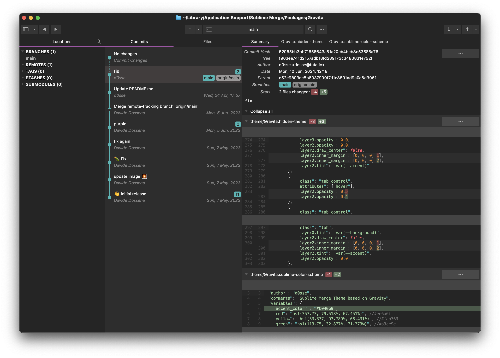

# Theme - Gravita (for Sublime Merge)

Gravita theme for Sublime Merge 2 based on [Gravity](https://github.com/frankyonnetti/gravity-sublime-theme) and [Manjaro](https://github.com/asapdotid/manjaro-theme-sb-merge)

The Sublime Merge Theme as a template with the Gravity color palette!

## Install

Assuming the required color scheme is installed, git clone the project or download it into your Sublime Merge `Packages`
folder as `Gravita`.

```bash
cd ~/Library/Application\ Support/Sublime\ Merge/Packages/
```
```bash
git clone git@github.com:d0sse/gravita-theme-sb-merge.git Gravita
```

Edit your merge `Preferences.sublime-settings` file to use the Gravita theme:

```json
    "theme": "Gravita.sublime-theme"
```

## Screenshots

Gravita



## License

MIT / BSD

## Author Information

This code was created in 2023 by [d0sse](https://github.com/d0sse) based on [Gravity](https://github.com/frankyonnetti/gravity-sublime-theme) and [Manjaro](https://github.com/asapdotid/manjaro-theme-sb-merge).
